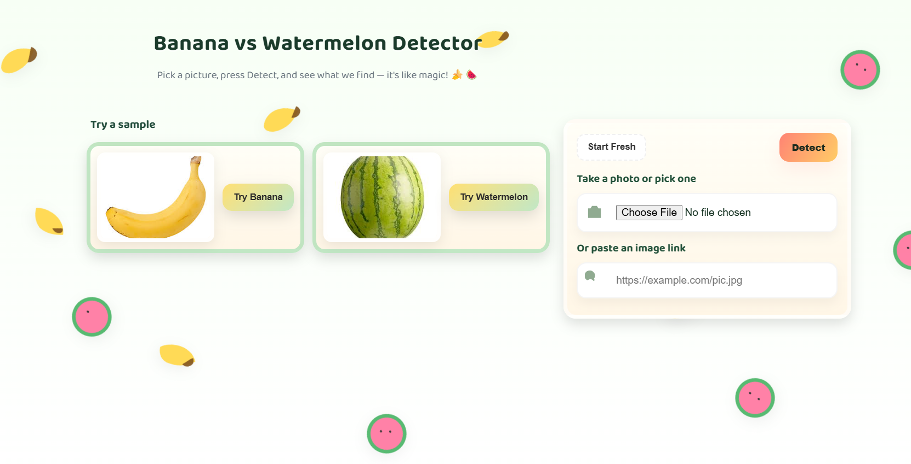

# 🍌🍉 Banana vs Watermelon Detector (YOLOv8 + Flask + Docker)

A minimal web app and REST API that loads a YOLOv8 model trained on bananas/watermelons and returns a single top label ("banana" or "watermelon"), counts per class, and an annotated preview.

## 🎯 What This Model Does

This application uses a **YOLOv8 (You Only Look Once)** object detection model specifically trained to identify and classify:
- **🍌 Bananas** - Detects individual bananas in images
- **🍉 Watermelons** - Identifies watermelon slices or whole watermelons
- **📊 Counting** - Provides accurate counts of each fruit type
- **🎨 Visualization** - Generates annotated images with bounding boxes and confidence scores

The model can process any image containing these fruits and provide real-time detection results through both a web interface and REST API.

## 🚀 Live Demo

**🌐 Live Application:** [https://object-detection-flask-app.onrender.com](https://object-detection-flask-app.onrender.com)

**📱 Try it out:** Upload an image with bananas or watermelons and see real-time detection!

## 🖼️ App Preview


*Example: Watermelon detection with bounding boxes and confidence scores*

## 🛠️ Setup Instructions (Local Docker)

### Prerequisites
- Docker and Docker Compose installed
- At least 3GB free disk space
- Internet connection for model download

### Quick Start with Docker

1. **Clone the repository:**
   ```bash
   git clone https://github.com/Fadelh7/object-detection-flask.git
   cd object-detection-flask
   ```

2. **Build and run with docker-compose (recommended):**
   ```bash
   docker compose up --build
   ```

3. **Or build and run manually:**
   ```bash
   docker build -t object-detection-app .
   docker run -p 8080:8080 \
     -v ${PWD}/uploads:/app/uploads \
     -v ${PWD}/static/outputs:/app/static/outputs \
     object-detection-app
   ```

4. **Access the application:**
   - **Web UI**: http://localhost:8080
   - **Health Check**: http://localhost:8080/health
   - **API Endpoint**: POST to http://localhost:8080/predict

### Docker Configuration Details

- **Base Image**: `python:3.11-slim` (lightweight, ~2.5GB total)
- **Dependencies**: CPU-only PyTorch + Ultralytics + OpenCV
- **Ports**: 8080 (configurable via PORT env var)
- **Volumes**: 
  - `./uploads:/app/uploads` - Stores uploaded images
  - `./static/outputs:/app/static/outputs` - Stores prediction results

### Environment Variables
- `YOLO_MODEL_PATH`: Path to model weights (default: `models/best.pt`)
- `CONF_THRES`: Detection confidence threshold (default: `0.25`)
- `PORT`: Flask server port (default: `8080`)

## 🎮 How to Use the Interface

### Web Interface
1. **Upload Image**: Click "Choose File" or drag & drop an image
2. **Select Sample**: Use the provided banana/watermelon examples
3. **Paste URL**: Input an image URL for remote images
4. **Click Detect**: Process the image and view results
5. **View Results**: See detection labels, counts, and annotated image

### REST API
**Endpoint**: `POST /predict`

**Request:**
```bash
curl -X POST http://localhost:8080/predict \
  -F image=@/path/to/your/image.jpg
```

**Response:**
```json
{
  "label": "banana",
  "counts": {"banana": 3, "watermelon": 1},
  "annotated_image": "/static/outputs/xxxx_pred.jpg",
  "detections": [
    {
      "class_id": 0,
      "class_name": "banana",
      "confidence": 0.91,
      "box_xyxy": [x1, y1, x2, y2]
    }
  ]
}
```

## ⚠️ Known Issues and Limitations

### Current Limitations
- **Model Size**: Custom model files (~20-100MB) cannot be stored in Git without LFS
- **Cold Start**: First request after inactivity may take 30-60 seconds
- **Memory**: Free tier deployments limited to 512MB RAM
- **Sleep Mode**: Free hosting platforms may put app to sleep after inactivity

### Solutions Implemented
- **Automatic Fallback**: Uses YOLOv8n if custom model unavailable
- **Model Hosting**: Supports downloading models from cloud storage URLs
- **Error Handling**: Graceful fallback and comprehensive error messages
- **Optimization**: CPU-only PyTorch for lightweight deployment

### Performance Considerations
- **CPU vs GPU**: Currently optimized for CPU deployment (no GPU required)
- **Image Size**: Large images may slow down processing
- **Concurrent Users**: Single worker configuration for stability

## 🏗️ Technical Architecture

### Frontend
- **HTML/CSS**: Clean, responsive web interface
- **Image Upload**: Drag & drop and file selection
- **Real-time Display**: Instant results with annotated images

### Backend
- **Flask**: Lightweight web framework
- **YOLOv8**: State-of-the-art object detection
- **OpenCV**: Image processing and annotation
- **PyTorch**: Deep learning inference engine

### Containerization
- **Docker**: Consistent deployment environment
- **Multi-stage Build**: Optimized for production
- **Volume Mounting**: Persistent storage for uploads/outputs

## 🚀 Deployment Options

### Render (Free Tier) - Currently Deployed
- **URL**: https://object-detection-flask-app.onrender.com
- **Build Command**: `pip install -r requirements.txt`
- **Start Command**: `gunicorn -w 2 -b 0.0.0.0:$PORT app:app`
- **Environment**: Automatic from `render.yaml`

### Other Platforms
- **Railway**: Similar to Render, good free tier
- **Fly.io**: Generous free tier, global deployment
- **Hugging Face Spaces**: Great for ML projects
- **Heroku**: Paid but very reliable

## 📁 Project Structure

```
object-detection-flask/
├── app.py                 # Main Flask application
├── models/                # YOLO model weights
│   └── best.pt           # Custom trained model
├── templates/             # HTML templates
│   └── index.html        # Main web interface
├── static/                # CSS, JS, output images
│   ├── styles.css        # Styling
│   └── outputs/          # Detection results
├── images/                # Sample images
├── uploads/               # Temporary image storage
├── Dockerfile             # Container configuration
├── docker-compose.yml     # Multi-container setup
├── requirements.txt       # Python dependencies
├── render.yaml            # Render deployment config
└── README.md              # This file
```

## 🔧 Development Setup

### Local Development (without Docker)
```bash
# Create virtual environment
python -m venv .venv
source .venv/bin/activate  # Windows: .venv\Scripts\activate

# Install dependencies
pip install --upgrade pip
pip install -r requirements.txt

# Set environment variables
export YOLO_MODEL_PATH=models/best.pt
export PORT=8080

# Run the app
python app.py
```

### Model Setup
1. **Place your trained model** in `models/best.pt`
2. **Or use the fallback**: App automatically downloads YOLOv8n
3. **Custom model hosting**: Update `render.yaml` with model URL

## 📊 API Documentation

### Health Check
- **GET** `/health` - Application status and model info

### Prediction Endpoint
- **POST** `/predict` - Process image and return detections
- **Content-Type**: `multipart/form-data`
- **Parameter**: `image` (file upload)
- **Response**: JSON with detection results

### Error Handling
- **400**: Invalid image format or missing file
- **500**: Model loading or inference errors
- **404**: Endpoint not found

## 🎯 Model Performance

### Detection Accuracy
- **Banana Detection**: High accuracy for various banana types and orientations
- **Watermelon Detection**: Robust detection of slices and whole fruits
- **Confidence Threshold**: Configurable (default: 0.25)
- **Processing Speed**: Real-time inference on CPU

### Supported Formats
- **Input**: JPG, PNG, JPEG, BMP
- **Output**: Annotated JPG with bounding boxes
- **Size**: Handles images up to 4K resolution

## 🤝 Contributing

This project is part of the ZAKA AI Final Project Challenge. Contributions are welcome:

1. Fork the repository
2. Create a feature branch
3. Make your changes
4. Test thoroughly
5. Submit a pull request

## 📄 License

- **Application Code**: MIT License
- **YOLOv8 Framework**: AGPL-3.0 License
- **Custom Model**: Your dataset/model may have different licenses

## 🆘 Troubleshooting

### Common Issues
1. **Model not found**: Check `models/best.pt` exists or use fallback
2. **Docker build fails**: Ensure sufficient disk space and memory
3. **App crashes**: Check logs for memory or dependency issues
4. **Slow performance**: Consider model optimization or GPU deployment

### Getting Help
- Check the [Issues](../../issues) page
- Review deployment logs
- Test locally with Docker first

## 🌟 Features

- ✅ **Real-time Detection**: Instant fruit classification
- ✅ **Dual Output**: Single top label + detailed counts
- ✅ **Visual Results**: Annotated images with bounding boxes
- ✅ **REST API**: Programmatic access via HTTP endpoints
- ✅ **Web Interface**: User-friendly upload and display
- ✅ **Docker Support**: Easy deployment and scaling
- ✅ **Model Fallback**: Automatic YOLOv8n if custom model unavailable
- ✅ **Production Ready**: Gunicorn server with health checks

---

**🎉 Ready for ZAKA AI Final Project Submission!**

This project demonstrates:
- **Model Selection and Packaging** ✅
- **Flask Application with UI** ✅
- **Docker Containerization** ✅
- **Online Deployment** ✅
- **Extra Mile: GitHub Documentation** ✅

**Live Demo**: [https://object-detection-flask-app.onrender.com](https://object-detection-flask-app.onrender.com)
